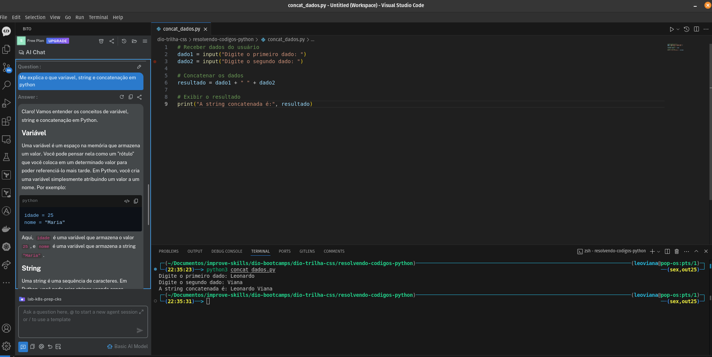

<h1 align="center">Resolução de código com ajuda da I.A</h1>

  
  

  

## ✨ Tecnologias

- Python
- Visual Studio Code
- Python
- JavaScript
- Bito

>[!NOTE]
>No lugar do  Github Copilot utilizei o [Bito](https://alpha.bito.ai/welcome-screen?ideInfo=eyJpZGVOYW1lIjoiVmlzdWFsIFN0dWRpbyBDb2RlIiwiaWRlVHlwZSI6InZzYyIsInBvcnQiOiIzMzEwMSJ9&client_name=VSCODE&client_version=1.4.1)
>Para resolução dos algoritmos, usei o `Python` para os 3 primeiros exercicios e `Javascript` para o s três últimos.